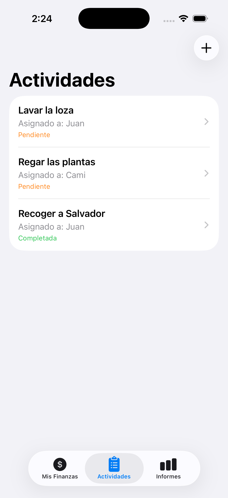

# Nosotros

Aplicacion iOS para organizar la vida en pareja. Permite gestionar actividades compartidas, finanzas y generar informes entre dos personas.

## Pantallazos

<p align="center">
  
</p>

## Funcionalidades

### Actividades
- Listado de actividades con estado (Pendiente, En Progreso, Completada)
- Colores por estado: naranja (pendiente), azul (en progreso), verde (completada)
- Crear nuevas actividades con titulo, persona asignada y fecha limite
- Ver detalle de cada actividad
- Marcar actividades como completadas

### Mis Finanzas (en desarrollo)
- Estructura lista para seguimiento de ingresos y gastos compartidos

### Informes (en desarrollo)
- Estructura lista para reportes y estadisticas

## Arquitectura

- **Patron**: MVVM (Model-View-ViewModel)
- **Framework**: SwiftUI
- **Estado**: Combine con `@Published` y `@StateObject`

## Estructura del proyecto

```
Nosotros/
  NosotrosApp.swift        # Punto de entrada
  MainTabView.swift        # TabView con 3 tabs
  ContentView.swift        # Lista de actividades
Models/
  Activity.swift           # Modelo de actividad
  ActivityStatus.swift     # Estados y colores
  FinanceType.swift        # Modelo de finanzas
Views/
  ActivityDetailView.swift # Detalle de actividad
  AddActivityView.swift    # Formulario nueva actividad
  FinanzasView.swift       # Tab de finanzas
  InformesView.swift       # Tab de informes
ViewModels/
  ActivityViewModel.swift  # Logica de actividades
```

## Requisitos

- Xcode 16+
- iOS 18+
- Swift 5.9+
